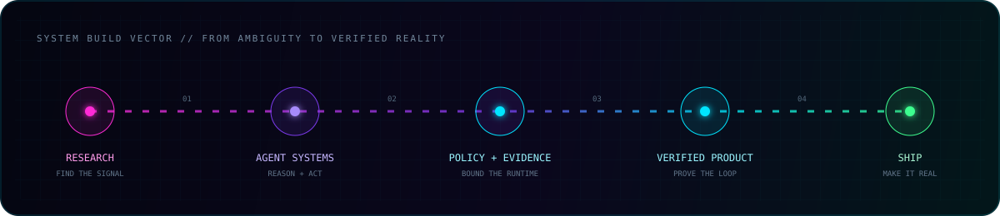
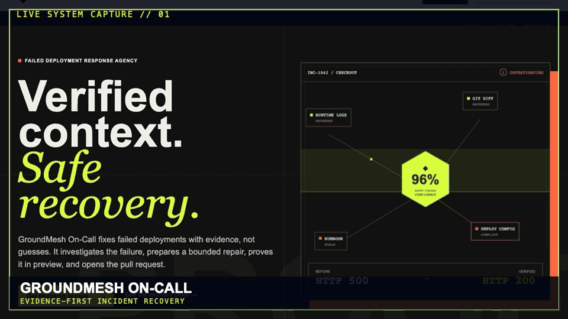

  

  

  
  
  
  

 

> I turn difficult operational problems into **inspectable AI systems and shipped products**. The model is one component; policy, evidence, interface design, runtime control, and human judgment are what make the system real.

<table>
  <tr>
    <td width="50%" valign="top">
      <h3>◈ VENTURE SIGNAL</h3>
      I build products around painful, high-leverage workflows: failed deployments, unsafe agent actions, operational context, and real-time decision systems.
    </td>
    <td width="50%" valign="top">
      <h3>◈ TECHNICAL EDGE</h3>
      Agent infrastructure, runtime control planes, simulation, evidence pipelines, local AI, full-stack product engineering, and operational UX.
    </td>
  </tr>
  <tr>
    <td colspan="2" valign="top">
      <h3>◈ OPERATING MODE</h3>
      <code>research → prototype → instrument → verify → ship</code> · Bengaluru, India · building globally · open to ambitious collaborations.
    </td>
  </tr>
</table>

  
  
  
  

 

  

  

## `// LIVE SYSTEM REEL`

  
   
  REAL PRODUCTS · LIVE INTERFACES · CAPTURED 05 AUGUST 2026

## `// FLAGSHIP SYSTEMS`

<table>
  <tr>
    <td colspan="2" valign="top">
      <h3><a href="https://github.com/shivanshgupta365/GroundMesh-On-Call">GroundMesh On-Call</a></h3>
      
<strong>Evidence-first failed-deployment response.</strong> Grounds itself in runtime, code, configuration, Git, and runbooks; prepares one bounded repair; verifies it; opens a human-reviewable pull request.

      
<code>Agent Systems</code> <code>Runtime Evidence</code> <code>GitHub Automation</code>

      
    </td>
  </tr>
  <tr>
    <td width="50%" valign="top">
      <h3><a href="https://github.com/shivanshgupta365/RiskDelta-AI">RiskDelta AI</a></h3>
      
<strong>Autonomous AI runtime control plane.</strong> Connects traces, policy hits, risk scoring, intervention, and operator evidence before unsafe agent behavior reaches production.

      
<code>TypeScript</code> <code>LLMOps</code> <code>Policy Engine</code>

      
    </td>
    <td width="50%" valign="top">
      <h3><a href="https://github.com/shivanshgupta365/GroundControl">GroundControl</a></h3>
      
<strong>Cinematic airport digital twin.</strong> Simulates 600 passengers, live disruptions, aircraft operations, and a deterministic optimizer inside an interactive 3D command surface.

      
<code>Next.js</code> <code>React Three Fiber</code> <code>Simulation</code>

      
    </td>
  </tr>
</table>

## `// SELECTED BUILDS`

<table>
  <tr>
    <td width="50%" valign="top">
      <h3><a href="https://github.com/shivanshgupta365/Commonstate">Commonstate</a></h3>
      
<strong>Operational context control plane</strong> that keeps humans and agents working from the same configurable, verified state.

      
<code>Enterprise AI</code> <code>Agent Memory</code> <code>Context Engineering</code>

      
    </td>
    <td width="50%" valign="top">
      <h3><a href="https://github.com/shivanshgupta365/BalconyBuddy-AI">BalconyBuddy AI</a></h3>
      
<strong>Local sensor-fusion garden intelligence</strong> for Arduino that stores evidence in SQLite, derives trends, detects contradictions, and recommends actions.

      
<code>Python</code> <code>Arduino</code> <code>SQLite</code> <code>Edge AI</code>

      
    </td>
  </tr>
  <tr>
    <td colspan="2" valign="top">
      <h3><a href="https://github.com/shivanshgupta365/Lantern-Windroot-Anime">Lantern Windroot</a></h3>
      
<strong>Procedural fantasy-anime short</strong> rendered in real time with deterministic cinematography, generated audio, narration, and film controls.

      
<code>WebGL</code> <code>React Three Fiber</code> <code>Creative Coding</code>

      
    </td>
  </tr>
</table>

<a href="https://github.com/shivanshgupta365?tab=repositories"><strong>Explore the complete build archive →</strong></a>

  

## `// TECHNOLOGY CONSTELLATION`

  
<strong>Languages · Product · Interface</strong>

  
    
  
<strong>Data · Infrastructure · Delivery</strong>

  

 

<table>
  <tr>
    <td align="center" width="25%"><strong>AI SYSTEMS</strong> agents · evaluations · local models · guardrails</td>
    <td align="center" width="25%"><strong>PRODUCT</strong> interaction · full-stack · rapid prototyping</td>
    <td align="center" width="25%"><strong>PLATFORM</strong> observability · Kubernetes · automation</td>
    <td align="center" width="25%"><strong>RESEARCH</strong> algorithms · simulation · secure systems</td>
  </tr>
</table>

## `// OPEN-SOURCE RADAR`

I contribute fixes and features upstream—not just forks. The work spans developer tooling, databases, web standards, ML systems, and agent evaluation.

<table>
  <tr>
    <td colspan="2" valign="top">
      <h3>✓ docsify #2772</h3>
      
Added a configurable right sidebar to the documentation framework.

      
    </td>
  </tr>
  <tr>
    <td width="50%" valign="top">
      <h3>✓ Caspian SDK #21</h3>
      
Added explicit TypeScript quality checks to the pull-request template.

      
    </td>
    <td width="50%" valign="top">
      <h3>✓ Caspian SDK #18</h3>
      
Corrected the Python onboarding polling reference for new SDK users.

      
    </td>
  </tr>
</table>

  
<strong>CURRENT UPSTREAM LANES</strong>

  
  
  
  
  
  
    
  

  

## `// ACHIEVEMENTS UNLOCKED`

<table>
  <tr>
    <td align="center" width="25%">
       
      <strong>Pull Shark</strong> Pull requests merged
    </td>
    <td align="center" width="25%">
       
      <strong>Quickdraw</strong> Fast issue resolution
    </td>
    <td align="center" width="25%"><h2>443</h2><strong>Signals / year</strong> Public + private contribution activity</td>
    <td align="center" width="25%"><h2>100</h2><strong>PR contributions</strong> Across the last year</td>
  </tr>
</table>

Verified contribution snapshot: 05 August 2026. Live telemetry below continues to evolve.

## `// GITHUB TELEMETRY`

  <picture>
    <source media="(prefers-color-scheme: dark)" srcset="https://github-readme-stats-sigma-five.vercel.app/api?username=shivanshgupta365&amp;show_icons=true&amp;include_all_commits=true&amp;rank_icon=percentile&amp;hide_border=true&amp;bg_color=00000000&amp;title_color=00E5FF&amp;text_color=B8C7D9&amp;icon_color=FF2BD6" />
    
  </picture>
  <picture>
    <source media="(prefers-color-scheme: dark)" srcset="https://github-readme-streak-stats-eight.vercel.app?user=shivanshgupta365&amp;hide_border=true&amp;background=00000000&amp;stroke=243447&amp;ring=FF2BD6&amp;fire=00E5FF&amp;currStreakNum=E8F3FF&amp;sideNums=E8F3FF&amp;currStreakLabel=00E5FF&amp;sideLabels=8EA4BA&amp;dates=62788E" />
    
  </picture>

  <picture>
    <source media="(prefers-color-scheme: dark)" srcset="https://github-readme-activity-graph.vercel.app/graph?username=shivanshgupta365&amp;bg_color=00000000&amp;color=8EA4BA&amp;line=00E5FF&amp;point=FF2BD6&amp;area=true&amp;area_color=7C3AED&amp;hide_border=true&amp;custom_title=CONTRIBUTION%20SIGNAL" />
    
  </picture>

### `// CONTRIBUTION CITYSCAPE`

  

### `// CONTRIBUTION SERPENT`

  <picture>
    <source media="(prefers-color-scheme: dark)" srcset="https://raw.githubusercontent.com/shivanshgupta365/shivanshgupta365/output/github-snake-dark.svg" />
    <source media="(prefers-color-scheme: light)" srcset="https://raw.githubusercontent.com/shivanshgupta365/shivanshgupta365/output/github-snake.svg" />
    
  </picture>

  

  <h2>Have a difficult system worth making real?</h2>
  
Bring the ambiguity, the edge cases, and the constraints. We will turn them into something observable, defensible, and shipped.

  
  
    
  <code>BUILD_BOLDLY // VERIFY_RUTHLESSLY // SHIP_THE_REAL_THING</code>

